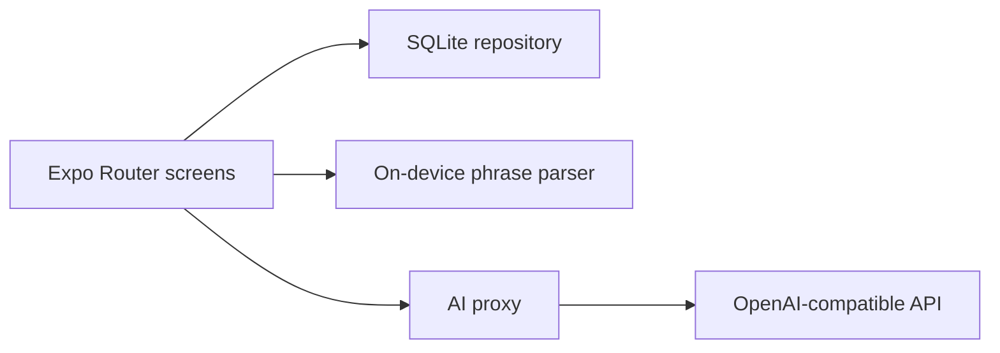

# Fynn

[](https://github.com/CarlosCubillos94/fynn/actions/workflows/ci.yml)

A personal finance app for the phone. Type `uber 4500` or `almuerzo 8000`, and Fynn suggests a category, keeps the ledger on the device, and tells you in plain language how this week compares with the last.

## Features

- Onboarding and an optional Face ID or fingerprint lock
- Optional starter plan in onboarding: enter your monthly income and Fynn proposes category budgets as shares of it, leaving part unassigned
- iOS Shortcuts capture: an App Intent (added by a config plugin) lets an Apple Pay automation queue a payment such as `Jumbo 18500`, which Fynn imports the next time it opens. Needs a development build, not Expo Go
- Phrase entry, plus a manual form for amount, category, note, and date
- On-device categorization, with an optional assistant through a proxy that never ships the API key
- Weekly summary computed from your own transactions
- Monthly balance, spending by category, and a six-month expense trend
- Budgets per category, with a warning at 80 percent
- Search, filters, and swipe to delete
- CLP and USD
- Light and dark mode
- Sample ledger on first launch, labeled as sample data

## Stack

Expo, React Native, TypeScript, Expo Router, NativeWind, Reanimated, Zustand, React Query, expo-sqlite, expo-local-authentication. Jest and React Native Testing Library. A small Node proxy for an OpenAI-compatible API.



## Project structure

```text
app/                 Expo Router screens (tabs, add, onboarding, lock, settings)
src/features/        Screen implementations by feature (auth, transactions, budgets, insights)
src/domain/          Pure TypeScript logic: money, phrase categorization, budgets, insights, starter plan
src/db/              expo-sqlite schema, repository and hooks
src/services/        Shortcuts capture queue and the optional AI client
src/components/ui/   Shared UI components (NativeWind)
plugins/             Expo config plugins for the iOS App Intent and scene lifecycle
proxy/               Small Node proxy for an OpenAI-compatible API
```

The domain layer has no React or database imports, so the money math, categorization and budget rules are unit tested in isolation.

## Run it

```bash
npm install
npm start
```

Then press `i` for the iOS simulator, `a` for Android, or `w` for the web demo.

```bash
npm test
npm run typecheck
npm run lint
npm run export:web
```

Tests cover money parsing and formatting, phrase categorization, budget thresholds, the weekly insight sentence, the starter plan, parsing of the Shortcuts capture queue and the phrase preview component. GitHub Actions runs lint, typecheck and tests on every push.

The first launch is a sample ledger. It is not a real account. Remove it in Settings.

## Assistant proxy

The app works fully offline. To let a model rephrase a category or the weekly sentence, run the proxy and point the app at it. The key stays in the proxy environment.

```bash
export OPENAI_API_KEY=your-key
export OPENAI_BASE_URL=https://api.openai.com/v1
export OPENAI_MODEL=gpt-4o-mini
npm run proxy
```

In `.env` for the app:

```bash
EXPO_PUBLIC_AI_PROXY_URL=http://localhost:8787
```

On a physical phone, use your computer's LAN address instead of `localhost`. Amounts are parsed on the device. The model is not allowed to invent them. If a rewritten insight drops the computed percent, Fynn keeps the on-device sentence.

## Screenshots

Capture the iOS simulator after `npm run ios`:

```bash
xcrun simctl io booted screenshot docs/home.png
```

The web build is the live demo: `npm run export:web`, then host the `dist` folder. The host needs `Cross-Origin-Opener-Policy: same-origin` and `Cross-Origin-Embedder-Policy: credentialless` so the on-device database can run in the browser.

## What I'd build next

- More currencies, still without mixing them in one total
- A widget for the phrase field
- Export of the ledger
- Shared budgets, only if the ledger can leave the device on purpose
